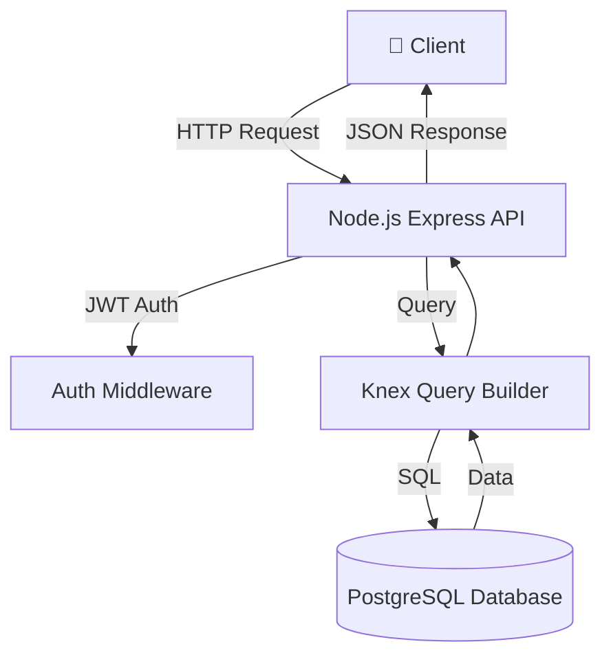

# 📦 Long Assignment - NodeJS + PostgreSQL

## 📖 Overview

This project is a backend API built with:

- Node.js (Express + TypeScript)
- PostgreSQL (via Docker)
- Knex (Query Builder)
- JWT Authentication

---

## 🚀 1. Prerequisites

Make sure you have installed:

- Docker & Docker Compose
- Node.js >= 18 (if running locally)

---

## ⚙️ 2. Environment Setup

Create a `.env` file in root:

```env
PORT=3000

DB_HOST=postgres
DB_PORT=5432
DB_NAME=pg_json_server
DB_USER=postgres
DB_PASSWORD=postgres

JWT_SECRET=your_secret
JWT_EXPIRES_IN=1d
```

---

## 🐳 3. Run with Docker (Recommended)

### Step 1: Build & Start

```bash
docker-compose up -d --build
```

### Step 2: Check running containers

```bash
docker ps
```

### Step 3: Run migration

```bash
docker exec -it node_app npm run migrate
```

---

## 💻 4. Run Locally (Without Docker)

### Step 1: Install dependencies

```bash
npm install
```

### Step 2: Update `.env`

```env
DB_HOST=localhost
```

### Step 3: Run PostgreSQL locally

### Step 4: Run migration

```bash
npm run migrate
```

### Step 5: Start server

```bash
npm run dev
```

---

## 🗄️ 5. Database

- PostgreSQL runs on port `5432`
- Database name: `pg_json_server`

---

## 🔐 6. Authentication

- Uses JWT
- Token expiration controlled via `.env`

---

## 🧱 7. Project Structure

```
src/
 ├── controllers/
 ├── db/
 ├── middlewares/
 ├── routes/
 ├── utils/
 └── index.ts
```

---

## 📊 8. Architecture Diagram



---

## 🔄 9. Development Scripts

```json
"scripts": {
  "dev": "nodemon",
  "build": "tsc",
  "start": "node dist/index.js",
  "migrate": "ts-node src/db/migrate.ts"
}
```

---

## 🧪 10. Testing API

You can test using:

- Postman
- Thunder Client (VSCode)

---

## ⚠️ 11. Common Issues

### ❌ Cannot connect to DB

- Check `DB_HOST`
  - Docker: `postgres`
  - Local: `localhost`

### ❌ Port already in use

```bash
lsof -i :5432
```

---

## 📌 12. Notes

- Docker volume is used to persist PostgreSQL data
- `.env` is shared between services
- Migration must be run manually after container starts

---

## 👨‍💻 Author

- Your Name
