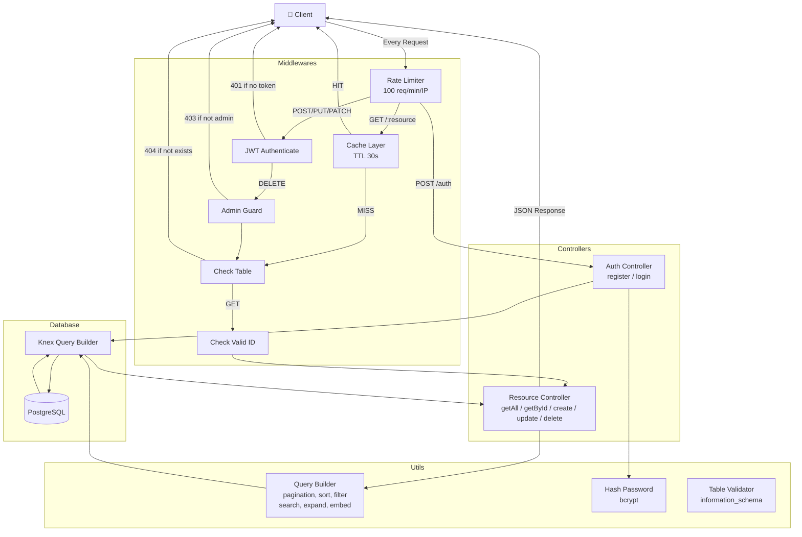

# 📦 Long Assignment - NodeJS + PostgreSQL

## 📖 Overview

This project is a dynamic REST API server — similar to `json-server` but powered by a real PostgreSQL database. It auto-generates CRUD endpoints from a `schema.json` file.

Built with:

- **Node.js** (Express + TypeScript)
- **PostgreSQL** (via Docker)
- **Knex** (Query Builder)
- **JWT** Authentication

---

## 🚀 1. Prerequisites

Make sure you have installed:

- Docker & Docker Compose
- Node.js >= 18 (if running locally)

---

## ⚙️ 2. Environment Setup

Copy `.env.example` and fill in your values:

```bash
cp .env.example .env
```

```env
PORT=3000

DB_HOST=postgres
DB_PORT=5432
DB_NAME=pg_json_server
DB_USER=postgres
DB_PASSWORD=postgres

JWT_SECRET=your_secret
JWT_EXPIRES_IN=1d
```

---

## 🐳 3. Run with Docker (Recommended)

### Step 1: Build & Start

```bash
docker-compose up -d --build
```

### Step 2: Check running containers

```bash
docker ps
```

### Step 3: Run migration

```bash
docker exec -it node_app npm run migrate
```

---

## 💻 4. Run Locally (Without Docker)

### Step 1: Install dependencies

```bash
npm install
```

### Step 2: Update `.env`

```env
DB_HOST=localhost
```

### Step 3: Run PostgreSQL locally (via Docker)

```bash
docker-compose up -d postgres
```

### Step 4: Run migration

```bash
npm run migrate
```

### Step 5: Start server

```bash
npm run dev
```

---

## 🗄️ 5. Database

- PostgreSQL runs on port `5432`
- Database name: `pg_json_server`
- Tables are auto-created from `schema.json` on first migration

---

## 🔐 6. Authentication

| Route | Method | Auth |
|---|---|---|
| `/auth/register` | POST | Public |
| `/auth/login` | POST | Public |
| `/:resource` | GET | Public |
| `/:resource/:id` | GET | Public |
| `/:resource` | POST | 🔒 Token required |
| `/:resource/:id` | PUT/PATCH | 🔒 Token required |
| `/:resource/:id` | DELETE | 👑 Admin only |

---

## 🧱 7. Project Structure

```
Long Assignment/
├── .vscode/
│   └── launch.json           # VSCode debug config
├── src/
│   ├── config/
│   │   └── swagger.ts        # Swagger setup
│   ├── controllers/
│   │   ├── auth.controller.ts
│   │   └── resource.controller.ts
│   ├── db/
│   │   ├── knex.ts           # Knex connection
│   │   └── migrate.ts        # Auto migration from schema.json
│   ├── middlewares/
│   │   ├── authenticate.ts   # JWT verify + role check
│   │   ├── cache.ts          # In-memory GET cache (TTL 30s)
│   │   ├── catchAsync.ts     # Async error wrapper
│   │   ├── checkIsValidId.ts # ID validation
│   │   ├── checkTable.ts     # Table existence check
│   │   ├── globalErrorHandler.ts
│   │   └── rateLimiter.ts    # 100 req/min/IP limiter
│   ├── routes/
│   │   ├── auth.route.ts
│   │   └── resource.route.ts
│   ├── utils/
│   │   ├── hashPassword.ts   # bcrypt hash & compare
│   │   ├── queryBuilder.ts   # Pagination, sort, filter, search, expand, embed
│   │   └── tableValidator.ts # information_schema check
│   └── index.ts              # Entry point
├── .env
├── .env.example
├── .gitignore
├── docker-compose.yml
├── Dockerfile
├── nodemon.json
├── package.json
├── schema.json               # Table definitions for auto-migration
├── swagger.json              # API documentation
└── tsconfig.json
```

---

## 📊 8. Architecture Diagram



---

## 🔍 9. Query Features

| Feature | Example |
|---|---|
| Pagination | `?_page=1&_limit=10` |
| Sorting | `?_sort=name&_order=desc` |
| Field select | `?_fields=id,email,role` |
| Filter | `?role=admin` |
| Range filter | `?id_gte=2&id_lte=5` |
| Not equal | `?role_ne=admin` |
| Like search | `?name_like=duc` |
| Full text search | `?q=keyword` |
| Expand parent | `?_expand=users` |
| Embed children | `?_embed=posts` |

---

## 🔄 10. Development Scripts

```json
"scripts": {
  "dev": "nodemon",
  "build": "tsc",
  "start": "node dist/index.js",
  "migrate": "ts-node src/db/migrate.ts"
}
```

---

## 🧪 11. Testing API

- **Swagger UI**: [http://localhost:3000/api-docs](http://localhost:3000/api-docs)
- **Postman**: Import `postman-collection.json` from the root

---

## ⚠️ 12. Common Issues

### ❌ Cannot connect to DB

- Check `DB_HOST` in `.env`:
  - Docker: `DB_HOST=postgres`
  - Local: `DB_HOST=localhost`

### ❌ Port already in use

```bash
# Check what's using the port
lsof -i :5432
lsof -i :3000
```

### ❌ Migration not running

```bash
# Run manually
npm run migrate

# Or inside Docker
docker exec -it node_app npm run migrate
```

---

## 📌 13. Notes

- Docker volume is used to persist PostgreSQL data across restarts
- `.env` is never committed — use `.env.example` as reference
- Migration is idempotent — safe to run multiple times (skips existing tables)
- Cache is in-memory and resets on server restart

---

## 👨‍💻 Author

- Nguyen Minh Duc (DucNM158)